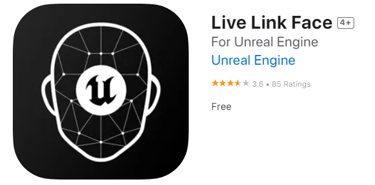

# livelink-for-facial-animation

## LIVELINK FACE FOR METAHUMAN FACIAL ANIMATION ##

- Livelink is a feature of Unreal Engine enabling real-time data streaming from external sources. It enables live facial animation capture, motion capture and other dynamic data inputs to be directly applied to a virtual character which enhances its the realism and expressiveness.   
   
Example of real time data streaming through LiveLink:
    

     
   
- In this project, the aim of using Live Link Face application is to capture high-fidelity facial animation from an actor through iPhone and then transfer it to the metahuman in real time.
   
Example video of the facial animation of one of the metahumans in the current project in Unreal Engine 5:  
   

   
**Preparation:🚨**
   
•	Make sure that the Metahuman Plugin and LiveLink Plugin are already installed.
   
•	Make sure that you download your Metahuman from Quixel Bridge and import it to your UE Project.
   
•	Make sure that Groom Plugin is installed to display your MetaHuman`s hair and beard textures.
    
•	Download LiveLink Face App on your iPhone.
   
   
   
•	Make sure your iPhone and computer are connected to the same wi-fi network.
   
**LiveLink Face App:📱**
   
1.	In the LiveLink Face App, choose “LiveLink(ARKit)” and proceed by clicking “Continue”.
   
2.	Go to Settings.
   
3.	Select “Live Link” under the “Streaming”.
   
4.	Type your computer`s IP address in the “Targets” section.
   
_To find your IP address: Open Command Prompt on your computer and type “ipconfig”. Look for IPV4 Adress._
   
5.	After typing your IP address on your LiveLink Face App, proceed to the next steps in UE.
   
**Unreal Engine:💻**
   
1.	In Unreal Engine 5. Go to “Window” > “Virtual Production” > “LiveLink”.
   
2.	You should see that your iPhone appears as a connected device in the LiveLink tab.
   
3.	Then, Select the BP of your Metahuman and in its settings go to the LiveLink section.
   
4.	Enable “UseARKit Face” and select your iPhone under ARKit Face Subj. 
   
5.	Your Metahuman should now mimic your facial expressions.😮😃🤔😂
   
**HOW TO RECORD THE FACIAL ANIMATION OF THE METAHUMAN IN UE?🎥**
  
1.	Add “Level Sequencer” to your UE Project.
   
2.	Drag and drop your Metahuman BP into the Sequencer.
   
3.	Go to  “Window” >  “Cinematics” >  “Take Recorder”.
   
4.	Go to “Source” in the Take Recorder. Select “From Actor” > Add the BP of your Metahuman.
   
5.	Click on the BP of your Metahuman.
   
6.	In the BP of your Metahuman, select “Root” > “Body” and unclick “Feet”, “Legs” and “Torso” to focus on facial animation.
   
7.	Change the frame rate within the Take Recorder from 24 fps to 30 fps.
   
8.	Initiate the recording. It will start after a 3 second countdown. 
   
9.	After recording animation, open the Sequencer and Delete the “FaceControlRig” from the sequencer.
   
10.	Click “Track” next to “Face” in the Sequencer.
   
11.	Go to “Animation” and select the animation you have just recorded.
   
12.	You can now play your recorded facial animation.🥳👏🌟
   
    

**🤯_If you are having trouble seeing your iPhone under the LiveLink Source in UE, you can apply these solutions:_**

1.	Switching your Network Profile to Private
   
Communication ports needs to be open to have a proper connection between Unreal Engine and your phone. Selecting your network profile to "Private" rather than "Public" can enable the communication between Unreal Engine and your phone.
   
2.	Opening UDP Port P11111
   
P11111 is a UDP port that Unreal Engine LiveLink feature uses to communicate with the devices on the network. Opening this port from computer`s firewall for the specific IP address of your phone can result flowing of data between UE and your phone. 
   
      
_References_   
   
Reference of the gif: https://dev.alexdjulin.ovh/livelinkface-to-unreal-metahuman-retarget    
Link of the LiveLink Face app: https://apps.apple.com/us/app/live-link-face/id1495370836
Link of the YouTube video that I used for recording facial animations: https://www.youtube.com/watch?v=_1iWOOKgO4E&

   

   

